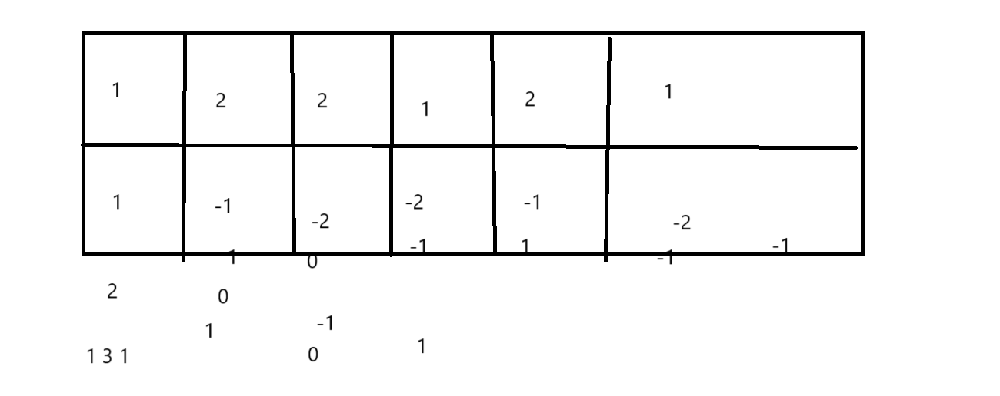
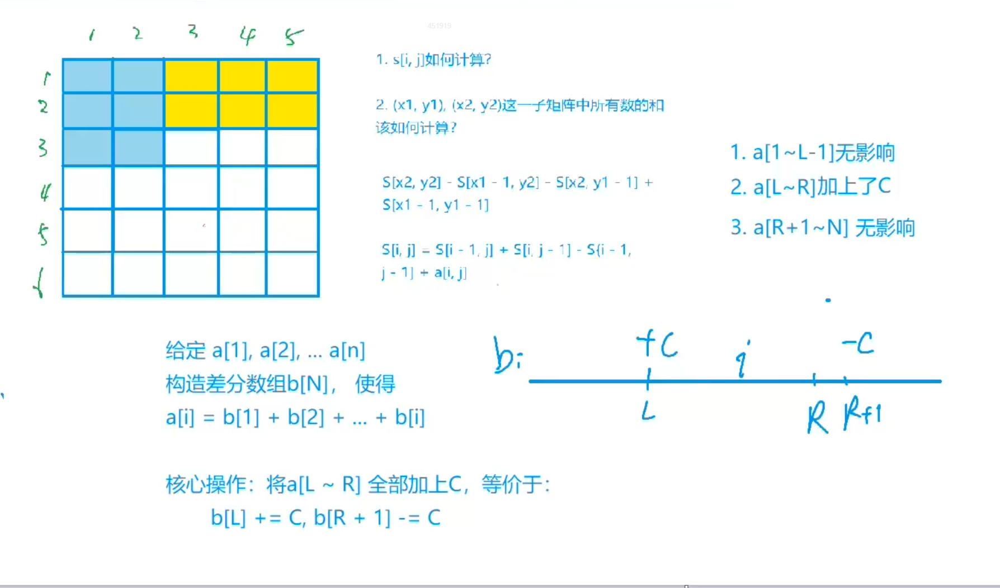
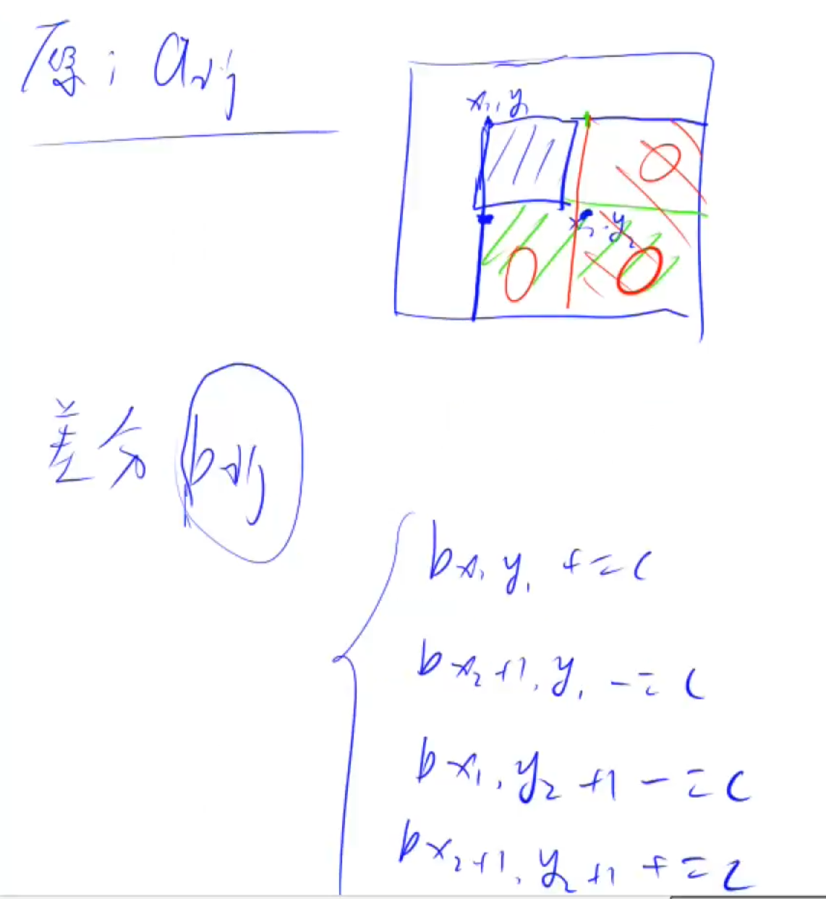

# 差分介绍

一般地，我们认为原序列就是差分序列的前缀和，所以把差分看做前缀和的逆运算

## 差分作用

让一个序列中某个区间内的所有值均加上或减去一个常数。

可以将对a数组任意区间的同一操作优化到O(1)。

优化作用

差分相当于 原序列的后一个数减去前一个数

树状数组插入和查询都可以优化到O(logn)。差分和前缀和适合用在查询或修改次数十分巨大的时候，当修改和查询在同一复杂度时适合用树状数组。

## 一维差分图

写代码时候 输入a[i]的同时可以进行insert 使b[i] b[i-1]的和为a[i]

进行询问的时候再次进行insert是对 区间内的数进行修改

## 二维差分图

